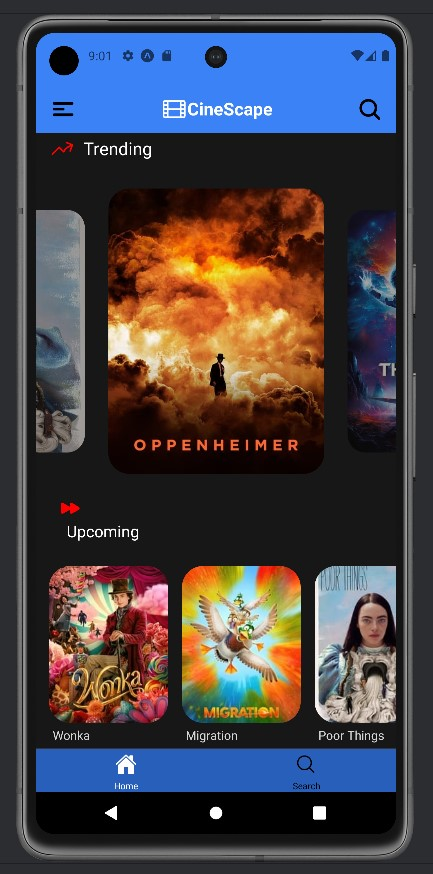

# CineScape

### React Native / Expo / NativeWind

 

  

 

    Frontend connected to the MOVIEDB API that allows you to search its database for
    your favorite movies and actors. Built with React Native, Expo and NativeWind.

 

## Project Setup

 

## Features

    ✔️ All the Movies you can imagine

    ✔️ Search Engine for Movies by Title

    ✔️ Tabs and Stack navigation

    ✔️ Error handling

    ✔️ User-friendly and functional design

    ✔️ NativeWind for the styles

    ✔️ User feedbacks with Toasts

    ✔️ Focus on accessibility

 

## Components

    ⚛️ DYNAMIC LISTS
        - Trending Movies
        - Upcoming Movies
        - Top Rated Movies

    ⚛️ SEARCH ENGINE
          Up to 20 results related to the title of the movie we have searched for

    ⚛️ MOVIE DETAIL PAGE
        - Movie image
        - Movie title
        - Year of release
        - Total running time
        - Genre
        - Movie overview
        - Top Cast: Cast List
        - Similar Movies: List of related Movies

    ⚛️ ACTOR/ACTRESS PAGE
        - Name
        - Place of birth
        - Gender
        - Birthday
        - Known for
        - % of Popularity
        - Biography
        - His/her Movies

    ⚛️  SPINNER
          Used for loading elements

 

## Technologies and Tools used

   
  
  
  
  

 

## Contribution

If you want to contribute to this project, follow these steps:

1. Perform a fork to the repository.

2. Create a branch for your feature or bugfix: `git checkout -b feature/your-feature-name`

3. Make the necessary changes and commits:  `git commit -m 'Add some feature'`

4. Push to branch: `git push origin feature/your-feature-name`

5. Send a pull request to the original repository.

 

## Project Status

 

## Project Developer

 

| [ Kevin Schans](https://github.com/KevinVanDerSchans) |
:------------------------------------------------------------------------------------------------------------------------------------------: |
